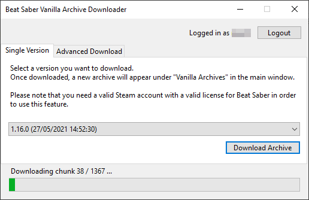

# BeatSaberKeeper
BeatSaberKeeper (or "BSK" for short) is a little utility program
for the VR rhythm game [Beat Saber](https://beatsaber.com/). It allows the user to
download and run multiple and older versions of BeatSaber. This is especially
useful for people who mod their games to add custom songs, adjust the UI or enjoy
custom game modes.

[**Download BeatSaberKeeper here**](https://github.com/rGunti/BeatSaberKeeper/releases/latest) -
[Check the **Release Notes**](/release)

_BeatSaberKeeper_'s Main Window - It lists the archives the user has created.
By using "Unpack & Run", BSK automatically unpacks the game files into the
right directory and starts the game. After a game session, the user can then
update the archive to reflect any changes that were made. This also allows
multiple users to play the game on the same computer using their own private
save state.

_BSK_ also includes a Song Explorer (which is currently in Beta) so you can manage
your custom levels without starting the game. You can also play songs.

The next release will also include the ability to open the Song Explorer inside an
archive so you can also see what songs are inside an archive.

BSKs Downloader Utility allows anyone with a [Steam](https://store.steampowered.com/)
account and a valid BeatSaber license to download older versions of the game.
The game files are downloader from the Steam network.

_Note_: If you don't own a Steam license for BeatSaber, you can still use BSK but
you can't use the Downloader utility. Also note that you use this tool at your
own risk!

## Compatibility
While the core of BeatSaberKeeper is written in .NET 5, which is cross-platform,
the UI is written with Windows Forms which makes it unfortunately Windows-only.

Pull Requests with a cross-platform GUI or other alternative interaction methods
(i.e. CLI) are very much appreciated.

## License
BeatSaberKeeper is covered by the GNU GENERAL PUBLIC LICENSE V3.
See [LICENSE](LICENSE) for more information.
