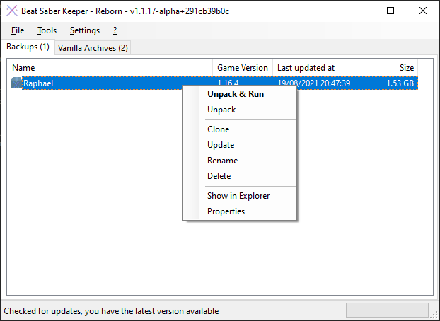

# Command Line
BeatSaberKeeper has a few command line parameters that influence how the application runs.

## Overview
```
BeatSaberKeeper_Reborn.exe
    [--help]
    [--version]
    [-w|--startup-window <App>]
    [--nolog]
    [-d|--data-dir <Directory>]
```

| Parameter                  | Default       | Description |
|:---------------------------|:--------------|:------------|
| `--help`                   | -             | Shows the command line help |
| `--version`                | -             | Shows the currently installed version |
| `-w`<br>`--startup-window` | `Default`     | Starts BSK with a specific window opened; see below |
| `--nolog`                  | -             | If specified, doesn't create a log file on disk |
| `-d`<br>`--data-dir`       | App Directory | If specified, changes the directory where BSK stores data |

## `-w` / `--startup-window`
The following startup windows exist and can be specified:

- `Default`: Opens the standard window listing stored archives.
  
- `Downloader`: Opens the BSK Downloader to download older versions from Steam
  
- `SongExplorer`: Opens the BSK Song Explorer to play or delete custom levels
  

## `-d` / `--data-dir`
By default, BSK will store all its data in the same directory as the executable in a subfolder
called `.bsk`. If you want to store your data somewhere else (for example in a personal folder
if you share your VR-PC with someone else) you can specify `--data-dir`. BSK will then create
a `.bsk` directory in the specified directory.

**Pro Tip**: Create a (Desktop) Shortcut to always start BSK with this data directory. To do
this, drag the executable with the right mouse button to your desktop (or any other folder you
want) and select "Create shortcuts here".


Then right click on the new shortcut and select "Properties", go to the "Shortcut" tab and
add the command line argument and the folder in the field "Target" like this:

```
--data-dir "Your Directory"
```


