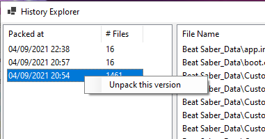

# About V2 Archives
BeatSaberKeeper Version 1.2 introduced a new archive version called "V2".
This article explains how BeatSaberKeeper archives work and what benefits
V2 brings.

## tl;dr
- BSK archives are ZIP files with a pre-defined file / folder structure
- V1 Archives have a very limited set of metadata and a simple one-to-one
  replication of the Beat Saber folder strucutre.
- V2 Archives have an extended metadata file which contains an index
  of all files and all revisions stored within the archive.
- V1 Archives have no support for "Updates". When updating V1 archives,
  BSK will simply delete the old archive and create a new one with the same
  name.
- V2 Archives keeps records of all files which allows deleted files to
  be restored at a later date.

## How BSK Archives work
BSK archives are essentially just ZIP files. If you rename a BSK archive
(ending in `.bskeep`) to `.zip` or open it with an archival program, like 7-zip,
you will find a simple file structure which contains all the files.

Both archive versions store metadata as an XML file in the archive, providing
additional information to BeatSaberKeeper to display, like the Version of the game
or the archive type (if it's either a Game Backup or a Vanilla Archive).

## V1's Archive Structure
A V1 archive looks something like this:

```
[+] Archive_V1.bskeep
 |
 +--+- meta.xml
    +- files
       +- Beat Saber.exe
       +- [...]
```

The V1 archive contains a `meta.xml` file, which stores the metadata and a folder
called `files` which is a one-to-one replica of the game files stored on your hard
disk. This allows for a very simple packing procedure since the folder strucutre
from the hard disk can just be copied and replaced when unpacking later.

```xml
<?xml version="1.0"?>
<BeatKeeperArchiveMetaData xmlns:xsi="http://www.w3.org/2001/XMLSchema-instance"
                           xmlns:xsd="http://www.w3.org/2001/XMLSchema">
  <ArchiveVersion>v1</ArchiveVersion>
  <GameVersion>1.16.4</GameVersion>
  <Type>ModBackup</Type>
</BeatKeeperArchiveMetaData>
```

As you can see from this sample of the `meta.xml`, it only contains very minimal
information, storing the game version, a backup type and a archive version hint.

However the drawbacks are that updating archives is very hard. When you actually use
the "Update" function of BSK, your archive will just be deleted and then BSH will
simply create a new archive with the same name. While this is a very simple process
it will need to read all files and compress them again and again.

## V2's Archive Strucutre
V2 archives use a similar strucutre to V1 archives:

```
[+] Archive_V2.bskeep
 |
 +--+- v2.meta
    +- 20210904-2054373019
    |  +- Beat Saber.exe
    |  +- [...]
    +- 20210904-2238416583
    |  +- [...]
    +- [...]
```

V2 Archives also have a metadata file, this file it is called `v2.meta`. When
BSK needs to determine what version an archive is, it will check if the metadata
file is called `meta.xml` (hinting at V1) or `v2.meta` (hinting at V2) and chooses
the corresponding implementation to read and process the archive.

## Improvments over V1
As you might have seen the folder strucutre of a V2 archive also differs in another
important way: There is no `files` folder anymore. V2 archives add the feature of
Versioning, which allows the archive to keep older versions of the game files.
This is realized by first keeping an index in the metadata file and sorting all
files by their date of addition. This is what the root folder strucutre represents.

The metadata file looks like this:

```xml
<?xml version="1.0"?>
<BeatSaberKeeperV2 xmlns:xsi="http://www.w3.org/2001/XMLSchema-instance"
                   xmlns:xsd="http://www.w3.org/2001/XMLSchema">
  <ArchiveVersion>v2</ArchiveVersion>
  <GameVersion>1.17.0</GameVersion>
  <Type>ModBackup</Type>

  <File p="BeatSaberVersion.txt">
    <Commit date="2021-09-04T21:12:28.1526276Z"
            hash="ef0d0d08386eeedbaa151bdd6e1815b0c4ab45c2a6f40574baa205ae5c8a22f9" 
            size="6" />
  </File>

  <File p="Beat Saber.exe">
    <Commit date="2021-09-04T21:04:55.038382Z" 
            hash="18a6f42837b2a4e450e95d4df1ecc00244f1170b4a1a795bbd47d55033b660cb" 
            size="650752" />
    <Commit date="2021-09-04T21:12:28.1526276Z"
            hash="18f8ec25aabdaa30748964440eb58b995e11ccf62fe4697bdda1e8b1c4850581" 
            size="650752" />
  </File>

  <File p="Logs\2021.09.02.10.05.37.log">
    <Commit date="2021-09-04T20:54:37.3019027Z"
            hash="67c36465c3adc6fa3c94ee2a984d79f2aa3c4b0167aaed5fad5abb1fda7f1971" 
            size="125153" />
    <Commit date="2021-09-04T20:57:53.5086274Z"
            deleted="true" />
  </File>
  <!-- ... -->
</BeatSaberKeeperV2>
```

If you compare this to v1's `meta.xml` this file contains a lot more information,
however the "head" is still the same, including the games version, archive version
and archive type. `v2.meta` however also contains a list of all files recorded and
archived by BSK. Each file creates a `<File>` tag with the full path within the
Beat Saber folder structure.

Within the `<File>` tag, BSK stores so called "Commits". A commit is essentially
a version of the file, which is described by a time stamp when this was recorded,
a SHA256 hash of the file and the uncompressed file size in bytes. When a file is
first added to an archive, a new `<File>` record with one `<Commit>` is added.
When the archive is updated at a later time, BSK will read this index again and
compare it against the files present on disk. Files that are present on disk and
on the index will be compared using the hash. If the hashes match, the file is
considered up-to-date and will not be added again to the archive, saving space
and time. If the hash or file size changes, the file is considered out-dated and
will be added, resulting in a new `<Commit>` record. In the example above,
the file `Beat Saber.exe` has been updated at a later point in time resulting in
a different hash and therefore a new commit.

Files that are present on the index but are no longer available on disk will
be marked as deleted. This is done by creating a "final" commit which contains
no hash or size but a flag `deleted`. In the example above, a log file called
`Logs\2021.09.02.10.05.37.log` was archived but deleted at a later date. To
honor this, BSK created a new `<Commit>` record with `deleted="true"`.
When the archive is unpacked later, BeatSaberKeeper will look at the latest
commit of an indexed file and simply not extract it, if the most recent commit
is flagged `deleted`.

## History Explorer
To leverage V2's improvements, BSK contains an additional window called
"History Explorer" which can be opened by selecting a V2 Archive and choosing
"Show History" from the context menu or from the "File" menu.

The History Explorer lists all recorded versions and the amount of files
changed. When a version is selected, all files are listed which were changed
at the same time. To unpack a specific version, right-click the record in
the list on the left and choose "Unpack this version".



## More planned features for V2
To make V2 more useful, the next releases of BSK will add utility features to
maintain these types of archives. For example it might be beneficial to remove
deleted or old files from an archive after a certain amount of time to save space.

Furthermore, "History Explorer" could also be extended to allow extracting single
files. "Song Explorer" might also benefit from V2 and allow it to not only show
the currently installed maps but also maps stored in archives and allow for
playback or even one-by-one restore.

Suggestions for new features are very welcome. Please submit them to the GitHub
Issues page found here:
[Create new Issue on GitHub](https://github.com/rGunti/BeatSaberKeeper/issues/new/choose).
