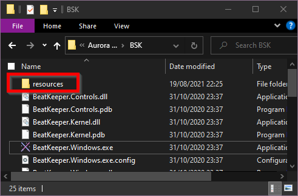

---
permalink: /help/where-are-my-archives
---

# Where are my archives?
If you were using BeatSaberKeeper before the 1.0 release, you're probably wondering
where your archives went. Don't worry, they are not gone! BeatSaberKeeper (_BSK_)
is storing its data in a different place now and this article shows you how to move
your archives from the old place to the new place.

In the folder where you saved your copy of BSK, there will be a folder called
`resources`. You will find your archives under `resources/archives/backup`. If you
have Vanilla game archives downloaded from Steam, they were stored under
`resources/archives/vanilla`.

BSK 1.0 and higher use a new folder called `.bsk`, which also lives in the same
folder as the application itself. I recommend that you install BSK 1.0 in a new
folder and move your archives over for compatibility reason. Also if you find
anything wrong, you still have the old version available.

To import your archives to BSK 1.0, copy (or move) all the `.bskeep` files from the
`resources/archives/backup` or `resources/archives/vanilla` folder into
`.bsk/archives`. **Do not** create any subfolders or your archives won't be shown.

Once you have imported your archives, relaunch BSK and your archives will show up
in the list.
