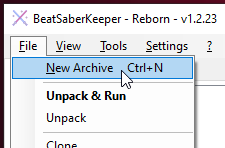

# Workaround for downloading old versions
BeatSaberKeepers download version is currently not working due to a change in
Steams API. As I am currently unable to provide a quick fix, I will provide a
workaround for you to make this somewhat work again.

## Prerequisites
- [DepotDownloader](https://github.com/SteamRE/DepotDownloader/releases)

## Step-by-step instructions
### Part 1: Preparation
1. Create a new folder. We will put all our files in here as we work on it.
   For this guide, I will call it `DepotFolder`.
2. Download the latest release of DepotDownloader, then unpack it into the
   `DepotFolder`. It should look something like this: 
   

### Part 2: Download Game
3. Next, hold the `[Shift]` key while right-clicking into an empty space in
   your Explorer window where your `DepotFolder` is open and select
   "Open PowerShell window here". 
   
   > On some older versions of Windows, this might say "Open Command Prompt here".
   > For the purpose of this guide, this option is also usable.
5. First, check if you can start the tool by typing this command: 
   `.\DepotDownloader.exe` 
   If you see a screen like this, it worked and you can continue. 
   
6. You will now have to create the correct command to download the version of
   BeatSaber you want. The general command will look like this: 
   `.\DepotDownloader.exe -app 620980 -depot 620981 -manifest <ManifestId> -username <SteamUser>` 
   You will have to replace `<ManifestId>` with the correct ID and 
   `<SteamUser>` with your Steam accounts login name. For reference you
   can use the table found on this Steam community thread:
   https://steamcommunity.com/sharedfiles/filedetails/?id=1805934840
   > For the purpose of this guide, I will choose Version `1.19.0`, which has the
   > manifest ID of `8948172000430595334`.
   > The resulting command will therefore be: 
   > `.\DepotDownloader.exe -app 620980 -depot 620981 -manifest 8948172000430595334 -username MyCoolUserName`
7. Once you have your command put together, execute it by pressing enter. You will
   then be asked to enter your Steam password and your Steam Guard token. Go ahead
   and do so. 
   
8. The download will now start and take a minute or two, depending on your internet connection.
   If everything goes as planned, it should end like this: 
   

### Part 3: Create an Archive of the Game
We're now gonna create a BeatSaberKeeper archive so you can reuse it later.

9. Open BeatSaberKeeper and click on "Settings" > "Set Game Directory". Then navigate
   to your `DepotFolder` and then to `depots/620981/7762726` (you can find this path
   also mentioned in the PowerShell window where you can the download command before)
   then select the `Beat Saber.exe`. 
   
10. Now select "File" > "New Archive" and give it a meaningful name, then click "Pack". 
    
11. Finally, go to "Settings" > "Set Game Directory" again and change it back to where
    your Steam version of BeatSaber is installed.

**Congratulations!** You have manually downloaded an older version of BeatSaber.
You can now use BeatSaberKeeper as you normally would.

You will notice that the Game Version will say `<unknown>`. This is because BSK cannot
identify BeatSabers version before it has been run at least once. It is however adviced
that you pack it before you run it to ensure your archive doesn't get corrupted by Steam
trying to autoupdate your game files again.

## FAQ
### Is all this really necessary?
For the moment, yes. DepotDownloader is a fairly reliable tool to download Steam games.
This was initially possible with Steam-native tools but Valve decided to patch this
functionality out. Also, BeatSaberKeepers download feature used parts of DepotDownloader
to make it work but since this has to be maintained by me alone, I can't promise anything.
In future versions I would like to (re-)incorporate DepotDownloader into BSK again so
you'll have a more reliable tool to work with.

### The guide didn't work for me?
That's unfortunate. Please report any mistakes via [GitHub issues][^1] or on [Reddit][^2].

### I know how to fix your program!
Really?!! In that case, feel free to fork this project on GitHub, create a fix and submit
a pull request. I would really appreciate your help.

[^1]: https://github.com/rGunti/BeatSaberKeeper/issues/new/choose
[^2]: https://www.reddit.com/r/beatsaber/comments/pbhnbs/i_wrote_a_program_to_backup_your_beat_saber/
